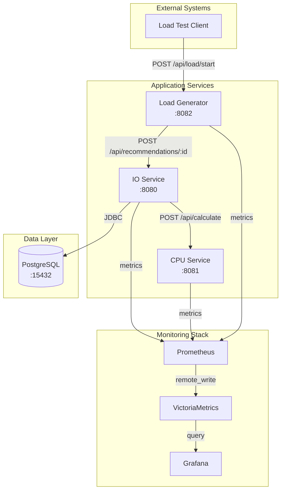

# Profiler Bench - Architecture Documentation

## Overview

The Profiler Bench is a microservices-based system designed to showcase profiler capabilities through realistic workload patterns. It consists of three Java 21 services that demonstrate different performance characteristics: IO-bound operations, CPU-intensive calculations, and load generation.

## System Architecture



## Service Descriptions

### 1. IO-Bound Service (Port 8080)

**Purpose**: Handles device recommendation requests with database operations.

**Technology Stack**:
- Spring Boot 3.2.2
- Spring Data JPA
- PostgreSQL Driver
- Liquibase for migrations
- RestTemplate for HTTP client

**Key Features**:
- 5-level method call depth for profiling visibility
- Database operations with JPA
- HTTP calls to CPU service
- Transaction management
- Connection pooling (HikariCP)

**Endpoints**:
- `POST /api/recommendations/{customerId}` - Get device recommendations
- `GET /actuator/health` - Health check
- `GET /actuator/prometheus` - Prometheus metrics

**Service Call Hierarchy** (5 levels):
```
Level 1: RecommendationController
  └─> Level 2: RecommendationService
      └─> Level 3: CustomerEnrichmentService
          └─> Level 4: DeviceAggregationService
              └─> Level 5: BuildingAnalysisService
                  └─> Repository Layer (JPA)
```

**Database Schema**:
- **customers** table: ~100,000 regular + 10 large customers
- **buildings** table: 1-3 per regular customer, 50-200 per large customer
- **devices** table: 1-10 per building (regular), 20-100 per building (large)

**Performance Characteristics**:
- Database queries with joins
- Data transformation and mapping
- HTTP client calls to CPU service
- Transaction overhead

### 2. CPU-Bound Service (Port 8081)

**Purpose**: Performs CPU-intensive device recommendation calculations.

**Technology Stack**:
- Spring Boot 3.2.2 (minimal dependencies)
- Pure Java computation

**Key Features**:
- Stateless service design
- 5-level calculation hierarchy
- Guaranteed 50-500ms CPU time per request
- Complex mathematical operations

**Endpoints**:
- `POST /api/calculate` - Calculate recommendations
- `GET /actuator/health` - Health check
- `GET /actuator/prometheus` - Prometheus metrics

**Service Call Hierarchy** (5 levels):
```
Level 1: CalculationController
  └─> Level 2: RecommendationCalculatorService
      └─> Level 3: DeviceScorerService
          └─> Level 4: CompatibilityAnalyzerService
              └─> Level 5: ScoreAggregatorService
                  └─> Utility Classes (MathUtils, ScoreCalculator)
```

**CPU-Intensive Operations**:
- Matrix multiplication (NxN matrices)
- Fibonacci number calculation (recursive)
- Prime number verification
- Custom hash calculations (multiple iterations)
- Statistical computations (mean, median, stddev)
- Compatibility scoring algorithms

**Performance Characteristics**:
- Configurable CPU time (50-500ms)
- No I/O operations
- Pure computational workload
- Memory allocation patterns

### 3. Load Generator (Port 8082)

**Purpose**: Generates configurable load patterns for testing and profiling.

**Technology Stack**:
- Spring Boot 3.2.2
- ExecutorService for thread management
- RestTemplate for HTTP client

**Key Features**:
- Configurable parallelism
- Three-phase load pattern (warmup, pause, measurement)
- Random customer selection
- Metrics collection (latency, throughput, errors)
- Thread-per-request model

**Endpoints**:
- `POST /api/load/start` - Start load test
- `GET /actuator/health` - Health check
- `GET /actuator/prometheus` - Prometheus metrics

**Load Test Configuration**:
```json
{
  "customerIds": [1, 2, 3, ...],
  "parallelRequests": 10,
  "warmupSeconds": 30,
  "pauseSeconds": 10,
  "measurementSeconds": 60
}
```

**Load Pattern Phases**:
1. **Warmup Phase**: 10% of requested load for JVM warmup
2. **Pause Phase**: Brief pause to stabilize metrics
3. **Measurement Phase**: Full load for profiling

**Metrics Collected**:
- Total/successful/failed requests
- Average/min/max latency
- Requests per second
- Phase duration

## Threading Model

All services use the **traditional thread-per-request model** (no virtual threads):
- Each HTTP request is handled in a dedicated thread
- All processing occurs in the same thread that received the request
- Load generator uses fixed thread pool with configurable size
- Synchronous HTTP calls throughout the system

This design ensures clear profiling data with visible thread allocation and stack traces.

## Data Model

### Customer
```
- id: BIGINT (PK)
- name: VARCHAR(100)
- email: VARCHAR(100) UNIQUE
- phone: VARCHAR(20)
- customer_type: VARCHAR(20) -- REGULAR or LARGE
- created_at: TIMESTAMP
```

### Building
```
- id: BIGINT (PK)
- name: VARCHAR(100)
- address: VARCHAR(200)
- building_type: VARCHAR(50) -- RESIDENTIAL, COMMERCIAL, INDUSTRIAL
- square_meters: INTEGER
- customer_id: BIGINT (FK -> customers)
```

### Device
```
- id: BIGINT (PK)
- name: VARCHAR(100)
- device_type: VARCHAR(50) -- SENSOR, ACTUATOR, CONTROLLER, etc.
- manufacturer: VARCHAR(50)
- model_number: VARCHAR(50)
- power_consumption: INTEGER (watts)
- installation_date: TIMESTAMP
- status: VARCHAR(20) -- ACTIVE, INACTIVE, MAINTENANCE
- building_id: BIGINT (FK -> buildings)
```

## Deployment

### Docker Compose Services

```yaml
services:
  postgres:       # PostgreSQL database
  cpu-service:    # CPU-bound calculations
  io-service:     # IO-bound operations
  load-generator: # Load generation
  prometheus:     # Metrics collection
  victoriametrics: # Metrics storage
  grafana:        # Metrics visualization
```

### Resource Limits
- **CPU Service**: 2 CPUs (1 reserved)
- **IO Service**: 2 CPUs (1 reserved)
- **Load Generator**: 2 CPUs (1 reserved)
- **PostgreSQL**: 1 CPU (1 reserved)

### Network Configuration
All services connected via `vm_net` Docker network for internal communication.

### Health Checks
All services expose `/actuator/health` endpoint with Docker health checks configured.

## Build & Run

### Prerequisites
- Docker & Docker Compose
- Java 21 (for local development)
- Gradle 8.5 (wrapper included)

### Quick Start
```bash
# Start all services
docker-compose up --build -d

# Check service health
docker ps

# View logs
docker-compose logs -f io-service cpu-service load-generator

# Stop services
docker-compose down
```

### Service URLs
- IO Service: http://localhost:8080
- CPU Service: http://localhost:8081
- Load Generator: http://localhost:8082
- PostgreSQL: localhost:15432
- Prometheus: http://localhost:9090
- Grafana: http://localhost:3000
- VictoriaMetrics: http://localhost:8428

## Testing

### Manual Test - Single Recommendation
```bash
curl -X POST http://localhost:8080/api/recommendations/1
```

### Load Test Example
```bash
curl -X POST http://localhost:8082/api/load/start \
  -H "Content-Type: application/json" \
  -d '{
    "customerIds": [1, 2, 3, 4, 5, 10, 20, 100, 1000],
    "parallelRequests": 10,
    "warmupSeconds": 30,
    "pauseSeconds": 10,
    "measurementSeconds": 60
  }'
```

### Test Script
```bash
./test-services.sh
```

## Monitoring & Metrics

### Prometheus Metrics
All services expose Spring Boot Actuator metrics at `/actuator/prometheus`:
- JVM metrics (memory, GC, threads)
- HTTP request metrics (latency, throughput)
- Custom application metrics
- Database connection pool metrics (IO service)

### Profiler Integration Points

**IO Service**:
- Database query performance
- Connection pool behavior
- HTTP client latency
- Transaction boundaries
- Object allocation patterns

**CPU Service**:
- CPU utilization patterns
- Method hotspots
- Algorithm performance
- Memory allocation in calculations
- Stack trace depth

**Load Generator**:
- Thread pool utilization
- Request distribution
- Latency distribution
- Error patterns

## Profiler Showcase Scenarios

### Scenario 1: Database Performance
- Profile IO service with large customers (100K+ devices)
- Analyze query execution time
- Identify N+1 query problems
- Connection pool contention

### Scenario 2: CPU Hotspots
- Profile CPU service during high load
- Identify most expensive calculations
- Analyze method call hierarchy
- Find optimization opportunities

### Scenario 3: Memory Allocation
- Profile both services under load
- Analyze object creation patterns
- Identify memory leaks
- GC pressure analysis

### Scenario 4: Thread Behavior
- Profile load generator
- Analyze thread pool utilization
- Identify thread contention
- Lock analysis

## Best Practices Implemented

1. **Layered Architecture**: Clear separation between controller, service, repository layers
2. **Dependency Injection**: Spring IoC container for loose coupling
3. **Transaction Management**: Proper @Transactional boundaries
4. **Error Handling**: Structured exception handling
5. **Logging**: SLF4J with appropriate log levels
6. **Health Checks**: Actuator endpoints for monitoring
7. **Configuration Externalization**: Environment-based configuration
8. **Data Validation**: Input validation at controller level
9. **Resource Management**: Proper connection pooling and thread management

## Performance Tuning Parameters

### IO Service
- `spring.datasource.hikari.maximum-pool-size`: 20
- `spring.datasource.hikari.minimum-idle`: 5
- `spring.jpa.hibernate.ddl-auto`: validate

### CPU Service
- `calculation.min-duration-ms`: 50
- `calculation.max-duration-ms`: 500
- `calculation.iterations-per-device`: 1000

### Load Generator
- `parallelRequests`: Controls thread pool size
- `warmupSeconds`: JVM warmup duration
- `measurementSeconds`: Profiling duration

## Troubleshooting

### Services Not Starting
1. Check Docker logs: `docker-compose logs <service>`
2. Verify port availability
3. Check database connectivity
4. Ensure sufficient resources

### Database Issues
1. Check Liquibase migrations
2. Verify PostgreSQL health
3. Review connection pool settings

### Performance Issues
1. Check CPU/memory limits
2. Review thread pool configuration
3. Analyze metrics in Prometheus
4. Profile with your profiler of choice

## Future Enhancements

Potential additions for extended profiling scenarios:
- Async processing with message queues
- Caching layer (Redis)
- Distributed tracing (OpenTelemetry)
- Additional load patterns (spike, wave, step)
- Microservice-to-microservice authentication
- Rate limiting and circuit breakers
